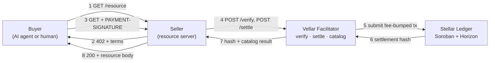
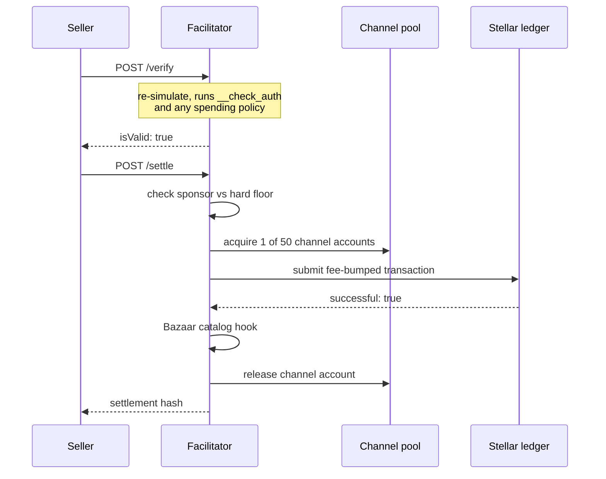
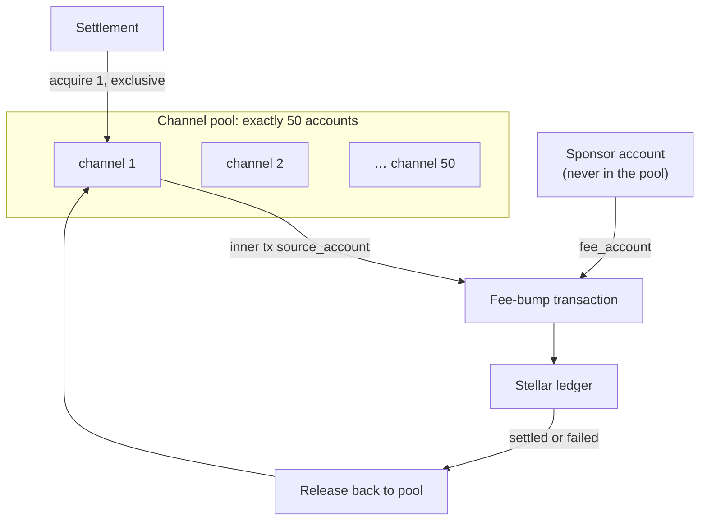
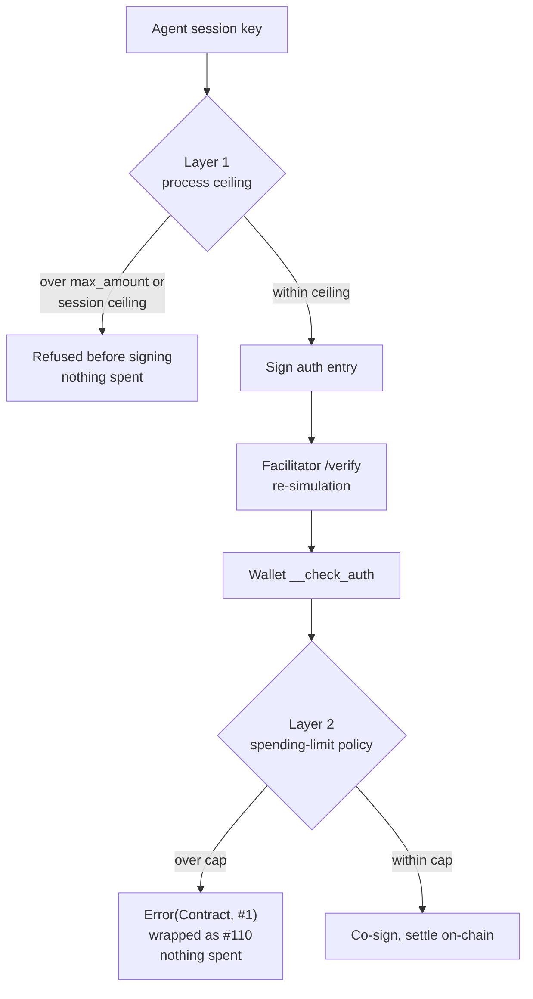
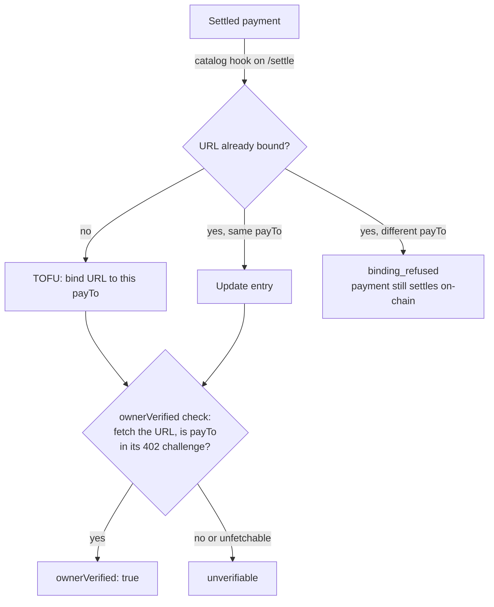
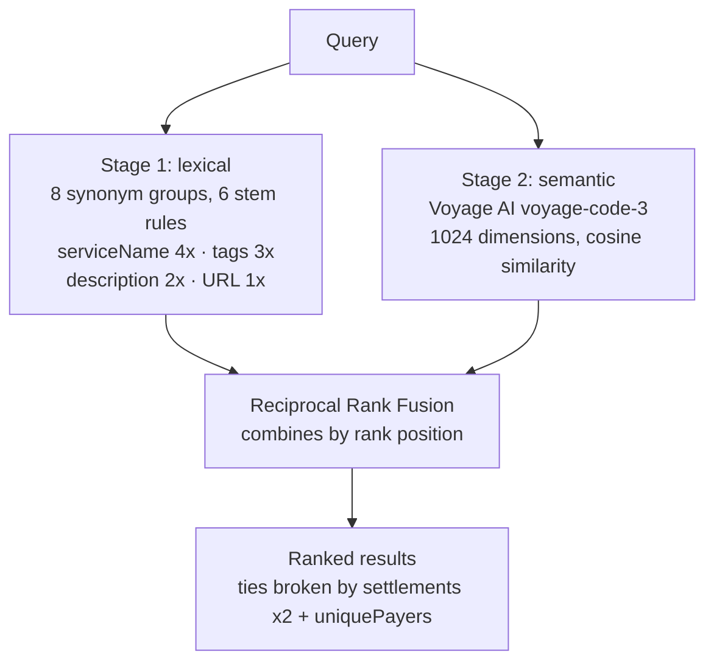

# Architecture Overview

> The whole system on one page: who talks to whom, what happens inside the
> facilitator during a payment, and where each guarantee is enforced. Each
> section links to the page that covers it in depth.

By the end of this page you will know the four actors in an x402 payment, the
order they act in, and which component enforces which property. Read this first
if you are evaluating whether to depend on Vellar; read the linked pages when
you need the detail behind a claim.

Vellar runs on `stellar:testnet` only. The hosted facilitator is
`https://vellar-facilitator.onrender.com`.

## System Overview

The buyer never talks to the facilitator directly on the `exact` path: the
seller does, because the seller is the party deciding whether to hand over the
resource. The buyer signs an authorization entry rather than a transaction, so
the facilitator builds and pays for the transaction that carries it. The buyer's
address appears as neither the transaction source nor the fee payer, which is
the non-custodial property you can check on Horizon.

For the protocol step by step, see
[The payment loop](../concepts/payment-loop.md). For what the buyer actually
signs, see [The exact scheme](../concepts/exact-scheme.md).

## Settlement Path

The critical step is re-simulation at `/verify`. A signature proves the buyer
signed something; it proves nothing about whether that something can succeed.
Simulation runs the buyer's `__check_auth` under current chain state, so a
payment that would fail on-chain is caught before any funds move.

Cataloging happens on settle, never on verify, and a cataloging failure never
changes the settlement result. See
[Settlement Path](./settlement-path.md) for every check in order, and
[Fees and Sponsorship](../reference/fees.md) for the three distinct quantities
called "fee".

## Channel Pool

A Stellar account's sequence number must increment exactly once per submitted
transaction. One shared source account under concurrent load means two
settlements read the same sequence number, one wins, and the other fails with
`txBadSeq`. Giving each concurrent settlement its own account removes the shared
state entirely, so there is nothing to collide on and nothing to retry.

The count is enforced as exactly 50 at boot, not as a minimum: 49 behaves like a
healthy pool until the 50th concurrent settlement, and extra keys are rejected
rather than trimmed so an operator who supplies 60 is not left believing they
bought capacity for 60. The sponsor is deliberately excluded, because it submits
its own funding and fee-bump transactions.

See [Channel Pool](./channel-pool.md) for the sizing argument, the monitor, and
`/health` interpretation.

## Smart Account Policy

The two layers are not redundant. Layer 1 lives in the same process the agent is
talking to and resets when that process restarts, so it guards against mistakes:
a typo, a runaway loop, a resource that costs more than expected. Layer 2 runs
inside the wallet contract's `__check_auth`, so the chain enforces it regardless
of what code submitted the transaction. A compromised agent, a modified SDK
build, or a hand-crafted envelope all meet the same contract.

Only layer 2 is a security boundary. The policy validates the token and the
amount and has no opinion on the recipient, so "the agent cannot exceed its
budget" is true while "the agent's funds are protected" is not.

See [Spending Policies](./spending-policies.md) for the execution path and how
to read an opaque `#110` refusal, and [Policies](../agent-tooling/policies.md)
for deploying and attaching them.

## Catalog Integrity

A resource enters the catalog only after a real payment settles for it. There is
no registration endpoint and no submission form, so spam costs real funds moved
on-chain to the `payTo` in the entry's own challenge. The cost of an attack
scales linearly with its size, and the attacker pays it.

Ownership is trust-on-first-use, and the facilitator does not take the binding on
trust from the payload: it fetches the URL and confirms the address appears in
the 402 challenge the resource actually serves. What TOFU cannot do is establish
who ought to have been first.

See [Catalog Integrity](./catalog-integrity.md) for the five verification
requirements, the metadata sanitisation rules, and the F11 controlled A/B test.

## Search and Retrieval

The two stages answer different queries. The lexical arm scores token overlap
and cannot rank a query that shares no vocabulary with any listing, because
there is nothing to score. The semantic arm handles exactly that case. RRF fuses
them by rank position rather than by score, so the two stages never have to
share a scale.

Hybrid raised MRR on semantic queries from 0.264 to 0.717 while leaving keyword
queries unchanged at 0.950, which is the whole argument for fusing rather than
replacing. Those figures come from a 19-entry catalog and should be read as
evidence the semantic arm changed something real on that corpus, not as a
quality claim about search at scale.

A Voyage outage degrades the ranking without breaking the endpoint, and the
response gives no indication that half the pipeline was missing.

See [Search and Retrieval](./search-and-retrieval.md) for the pipeline detail
and [Search Evaluation](../reference/evaluation.md) for the query sets.

## Next steps

- [Settlement Path](./settlement-path.md)
- [Channel Pool](./channel-pool.md)
- [Spending Policies](./spending-policies.md)
- [Catalog Integrity](./catalog-integrity.md)
- [Threat Model](./threat-model.md)
- [Search and Retrieval](./search-and-retrieval.md)
