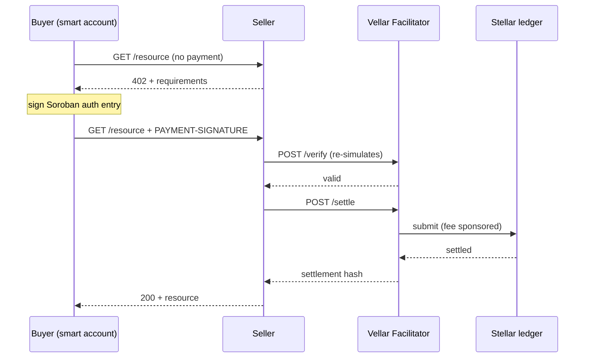

# Sign and Pay

> How an x402 payment works on Stellar step by step — the 402 challenge, signing
> a Soroban authorization entry, the retry, and the settlement you read back.

By the end of this page you will understand every step `wallet.x402.fetch()`
takes, why the facilitator re-simulates rather than just verifying the
signature, and how auth entry expiration affects retries.

## The payment loop

Every x402 payment on Stellar follows the same six steps. Understanding this
loop is what lets you diagnose failures without guessing.

1. **Request the resource.** The client makes an ordinary HTTP request to a paid
   endpoint. Nothing is signed yet, and nothing is spent if you stop here.
2. **Receive the 402 challenge.** The resource server answers `402 Payment
   Required` with the payment requirements — amount, asset, recipient, network.
   Everything the client needs to build a payment arrives in this response.
3. **Build the transfer.** The client builds the SEP-41
   `transfer(from = smart account, to = payTo, amount)`. This is a Soroban
   contract invocation, not a classic Stellar payment operation.
4. **Sign the auth entry.** The wallet's Soroban authorization entry is signed
   with the session key, producing V1 (`sorobanCredentialsAddress`) credentials.
   The signature covers the authorization, not a whole transaction.
5. **Retry with the payment header.** The client repeats the request carrying
   the `PAYMENT-SIGNATURE` header. The seller forwards that payload to the
   facilitator rather than validating it itself.
6. **Verify and settle.** The facilitator verifies by re-simulation, then
   settles on-chain and sponsors the fee. Because verification re-simulates, an
   over-budget or wrong-token payment is rejected *before* it settles.

## Auth entries, not transactions

What the buyer signs is a Soroban **authorization entry**, not a complete
transaction. The facilitator builds the transaction around that signed entry and
sets its own account as the source before submitting, which is why the buyer's
smart account needs no XLM: the source account pays the network fee, and that
account is the facilitator's. Your `simulationSourceAccount` is only ever used
to simulate — it never signs and is never charged.

## Why re-simulation matters

Verification is not a signature check. The facilitator re-simulates the payment
against the chain, which runs the paying account's `__check_auth` and therefore
any spending-limit policy attached to the signing key. An over-budget payment is
caught at this point, before anything settles and before any fee is spent.

That is also why policy-governed payments cost more: running the policy contract
inside `__check_auth` raises the fee, where a plain transfer stays well under
the default ceiling. A policy-governed payment bids roughly 130,000 stroops and
charges roughly 86,000 stroops actually on-chain. See
[Fees and Sponsorship](../reference/fees.md) for the bid-vs-charge distinction.

> **Note:** The Vellar facilitator ships with a 500,000-stroop fee ceiling
> specifically so policy-governed agent payments settle instead of being
> refused. The reference `x402.org` facilitator defaults to 50,000 stroops and
> rejects them with `fee_exceeds_maximum`.

## Auth entry expiration

> ⚠️ **Signatures expire in ledgers, not wall-clock time.** A Soroban
> authorization entry is valid only up to a specific ledger sequence number.
> Once that ledger passes, the signature is dead — verify and settle both fail,
> and no retry of the same payload can succeed. Sign fresh.

The SDK sets that expiration via `expirationLedgerOffset`, the number of ledgers
added to the current ledger when the entry is signed; testnet closes a ledger
roughly every 5 seconds. The [`upto`](../upto.md) contract enforces a separate
ceiling — `expiration_ledger` must not exceed `current_ledger + 17,280` (~24h at
5s/ledger) — which is that contract's replay-protection window and a different
mechanism from your wallet's config.

## The V1 credential requirement

The SDK builds the smart-wallet signature format itself rather than delegating
to `passkey-kit`. That is deliberate: passkey-kit upgrades to V2 credentials,
which hosted facilitators reject. Both signers therefore produce **V1
(`sorobanCredentialsAddress`) credentials** in the format the account's
`__check_auth` expects.

## What fetch() returns

| Field | Type | When present | What it is |
|---|---|---|---|
| `response` | Response | Always | The HTTP response from the seller |
| `paid` | boolean | Always | Whether a payment was made |
| `settlement.transaction` | string | When paid | The on-chain tx hash |
| `settlement.payer` | string | When paid | The paying account address |
| `settlement.asset` | string | When paid | The asset contract id |
| `settlement.amount` | string | When paid | Amount in atomic units |
| `settlement.network` | string | When paid | The Stellar network |

## When it fails

| Error | Cause | Fix |
|---|---|---|
| `PaymentRejectedError` | Facilitator rejected at verify | Check the error reason — usually over-budget policy or wrong asset |
| `InvalidRequirementsError` | 402 challenge was malformed | The seller's paywall config is broken — contact the seller |
| Signature expired before settle | Soroban RPC slow or ledger congestion | Sign fresh and retry — the payload cannot be reused |
| `fee_exceeds_maximum` | Policy-governed payment, facilitator ceiling too low | Use the Vellar facilitator which has a raised ceiling |
| Empty transaction on settle | Transient RPC TRY_AGAIN_LATER | Sign fresh and retry once — nothing was spent |

## Next steps

- [Pay for a resource](./pay-for-a-resource.md) — the full flow with code
- [Spend controls](./spend-controls.md) — maxAmount vs the on-chain budget
- [Discover services](./discover-services.md) — find resources without
  hardcoded URLs
- [Facilitator & Bazaar](../facilitator.md) — the verify/settle service and its
  fee ceiling
