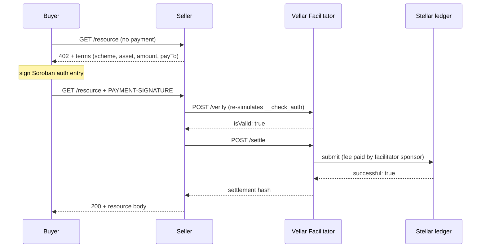

# The Payment Loop

> x402 is an HTTP payment protocol: a server answers a request with 402 and
> terms, the client signs a payment and retries, and a facilitator verifies and
> settles it on-chain.

By the end of this page you will know every participant in an x402 payment,
every step of the loop, and why each step exists, so that when a payment fails
you can name the step that broke instead of guessing.

## Prerequisites

- A rough idea of what an HTTP `402 Payment Required` response is
- Familiarity with Stellar accounts and Soroban contracts (see
  [Stellar essentials](./stellar-essentials.md))

## The four participants

| Participant | Who they are | What they hold | What they never hold |
|---|---|---|---|
| Buyer | The account that pays (a Vellar smart account `C...` or a classic `G...` keypair) | The payment asset, such as testnet USDC | XLM for fees, when fees are sponsored |
| Seller (`payTo`) | The account that receives the payment | A trustline to the payment asset | Buyer funds before settlement |
| Facilitator | Vellar's hosted service at `https://vellar-facilitator.onrender.com` | XLM for fees only, in its sponsor account `GBUCR6H22CZC5OYHBJIEUS2JFZBOB63AHEGTCV6UEPMD2TMLKG2ZMIW4` | Buyer funds, never |
| Token contract | The SEP-41 asset's Stellar Asset Contract, e.g. USDC testnet `CBIELTK6YBZJU5UP2WWQEUCYKLPU6AUNZ2BQ4WWFEIE3USCIHMXQDAMA` | The on-chain asset balances | Nothing else |

> ⚠️ **The facilitator is never a party to the transfer.** Buyer funds move
> directly from the buyer to the seller's `payTo` address. The facilitator's
> account appears in the transaction only as the source that pays the Stellar
> network fee, which is what makes the arrangement non-custodial: the
> facilitator can refuse to submit a payment, but it cannot redirect one or
> hold your money.

## The six steps

### Step 1: The buyer requests the resource with no payment

The buyer makes an ordinary HTTP request to the resource URL, carrying no
payment header at all. Nothing goes wrong at this step, because nothing is
signed and nothing is spent: an unpaid first request is always safe.

### Step 2: The seller responds 402 with terms

The seller answers `402 Payment Required` with the payment requirements: the
scheme, the network, the asset, the amount, the `payTo` address and
`maxTimeoutSeconds`. If this step is broken the buyer has no idea what to pay,
and the fault is in the seller's configuration, not the buyer's client.

> **Note:** Debug a paid route with `GET`, not `HEAD`. A `curl -I` returns a
> plain `200` because a `HEAD` request carries no payment challenge.

### Step 3: The buyer signs a Soroban authorization entry

The buyer signs an authorization entry for exactly that transfer: one asset,
one amount, one recipient. If any field changes after signing, the signature no
longer covers the call and the payment is rejected.

### Step 4: The buyer retries with the signed payment

The buyer repeats the same request with the signed payment in the
`PAYMENT-SIGNATURE` header. Authorization entries expire in ledgers rather than
wall-clock seconds, so once the entry has expired the retry cannot reuse the
same payload and the buyer must sign a fresh one.

### Step 5: The facilitator verifies by re-simulation

The seller posts the payload to `POST /verify`, and the facilitator re-simulates
the whole transaction against the chain, which runs the buyer's `__check_auth`
and therefore any spending-limit policy attached to the signing key. An
over-budget payment is refused here, before anything settles, and the SDK
surfaces that as `PaymentRejectedError` carrying the reason.

### Step 6: The facilitator settles on-chain

The seller posts to `POST /settle`, the facilitator rebuilds the transaction
with its own account as the source, pays the network fee, submits it, and
returns the settlement hash in the `PAYMENT-RESPONSE` header. If Soroban RPC
answers `TRY_AGAIN_LATER` the transaction is never submitted and nothing is
spent, so you sign a fresh payload and retry.

> **Note:** The hosted facilitator runs on a free tier and sleeps after 15
> minutes idle. The first call after a sleep can take 30 to 90 seconds, and
> occasionally up to 2 minutes, before step 5 answers.

## Auth entries, not transactions

The buyer signs an authorization entry, not a full transaction. That entry
authorizes one specific contract call, `transfer(from = buyer, to = seller,
amount)`, on the asset's Stellar Asset Contract, and nothing else. The
facilitator builds the full transaction around that entry and sets its own
account as the transaction source, which is how the buyer avoids needing XLM.
Change the amount or the recipient after signing and the signature no longer
matches the call it was signed for, which the facilitator catches at verify.

## Why re-simulation matters

Verification is not a signature format check. The facilitator re-simulates the
entire transaction against the chain, which executes the buyer's `__check_auth`,
and `__check_auth` is exactly where a spending-limit policy is enforced, so an
over-budget payment is caught before any funds move. That thoroughness has a
cost: running a policy adds resource fees, and a policy-governed payment raises
the simulation-derived fee to roughly 130,000 stroops (the worst settlement
measured on testnet was 127,808). Vellar's facilitator ships a ceiling of
500,000 stroops, raisable via `MAX_TX_FEE_STROOPS`, while the reference
`x402.org` facilitator defaults to 50,000 and rejects policy-governed payments
with `fee_exceeds_maximum`.

## The two schemes

| Scheme | Buyer signs | What settles | Use for |
|---|---|---|---|
| `exact` | One specific amount | Exactly that amount | Fixed-price calls |
| `upto` | A spending ceiling | Actual usage only | Metered billing |

See [The exact scheme](./exact-scheme.md) and
[The upto scheme](./upto-scheme.md) for the payload shapes and the failure
modes specific to each.

> ⚠️ **`upto` is experimental.** It is a Vellar-specific extension of x402 v2
> and is not in the finalized spec. `wallet.x402` does not build `upto`
> payments; it is `exact` only.

## When it fails

| Symptom | Cause | Fix |
|---|---|---|
| Verify returns invalid with a policy reason | A spending-limit policy blocked the payment inside `__check_auth` | Check the policy window and the remaining budget |
| Empty `transaction` field on settle | Soroban RPC answered `TRY_AGAIN_LATER` | Sign a fresh payload and retry once, nothing was spent |
| Signature rejected at verify | The auth entry was simulated from the payer address | Use a different funded `G...` account for `simulationSourceAccount` |
| Payment verifies but fails at settlement | The seller's `payTo` is missing a trustline | The seller must add a trustline to the payment asset |
| Resource returns 200 but is not cataloged | Extensions were not echoed in the buyer's payload | Echo `required.extensions` into the payment payload |

## Next steps

- [The exact scheme](./exact-scheme.md), one amount, signed and settled
- [The upto scheme](./upto-scheme.md), a ceiling signed, actual usage settled
- [Pay for a resource](../buyers/pay-for-a-resource.md), the loop as runnable code
- [Sign and pay](../buyers/sign-and-pay.md), what happens between `fetch()` and the hash
